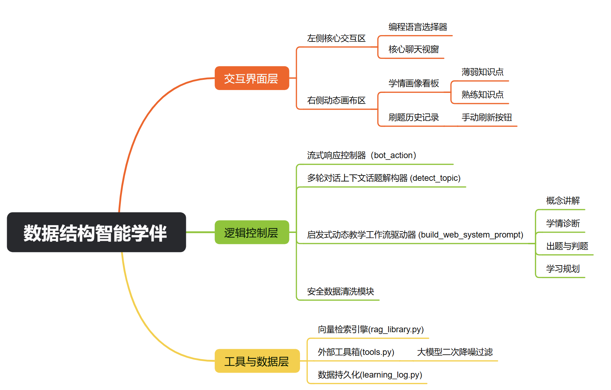
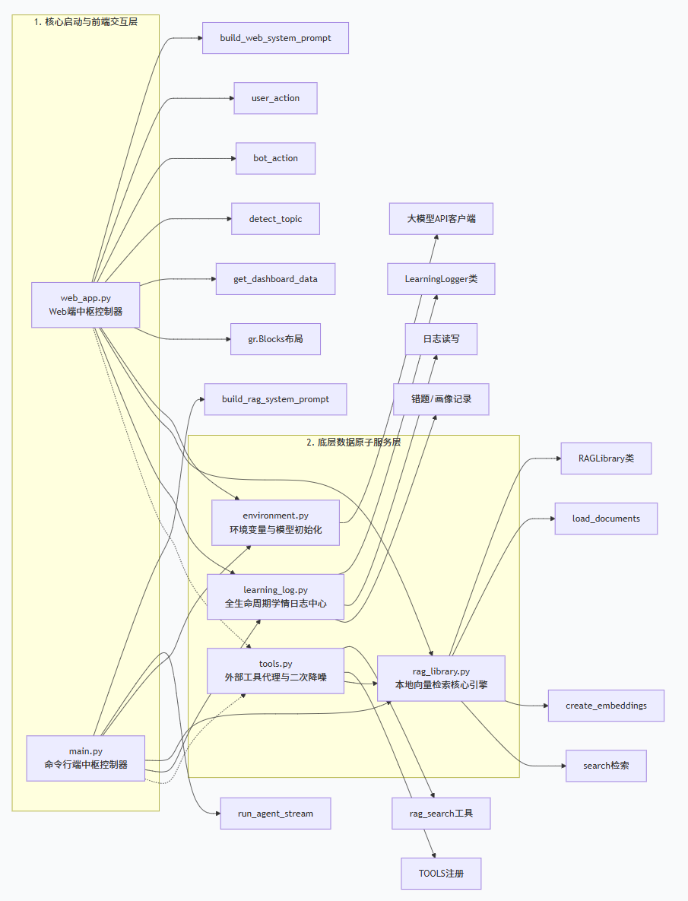
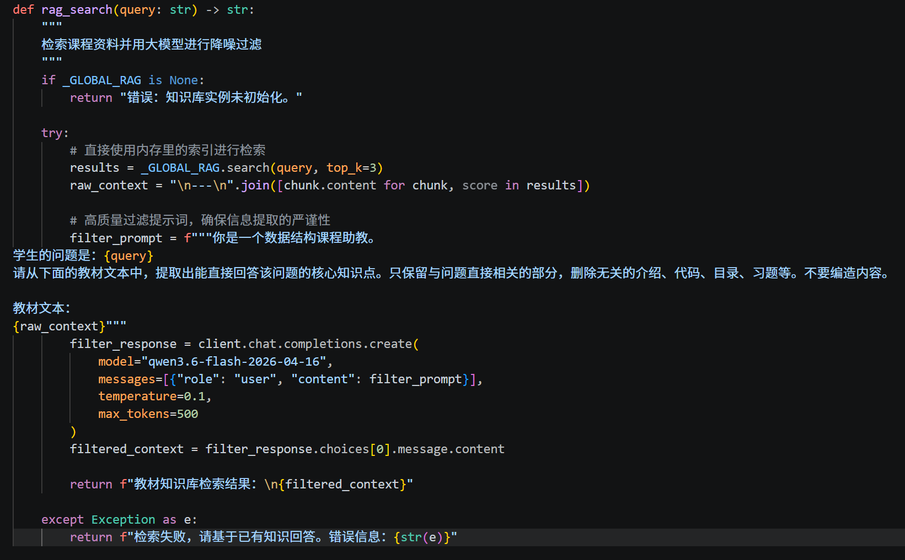
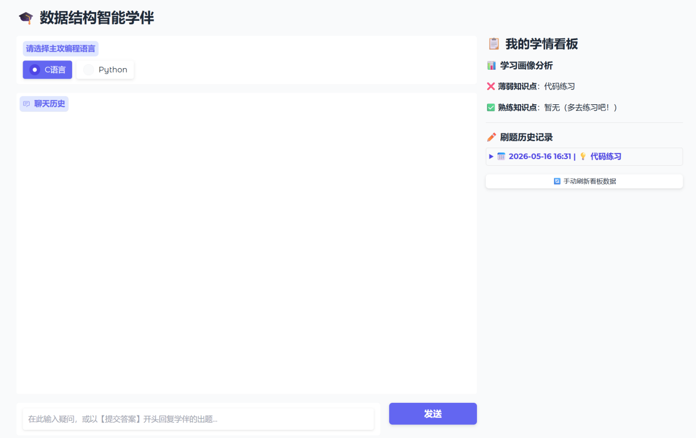
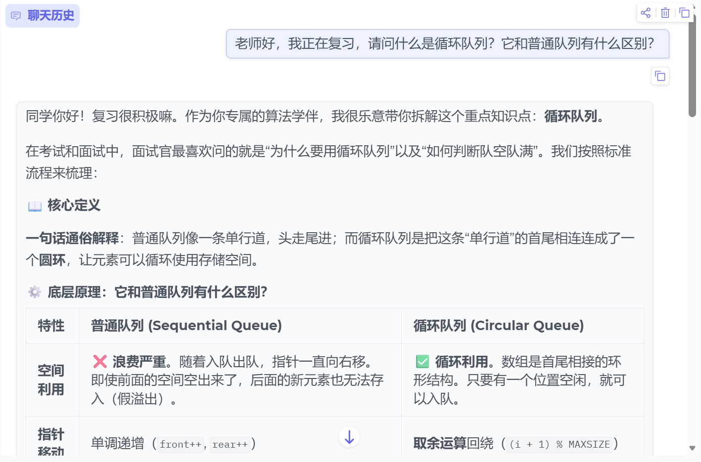
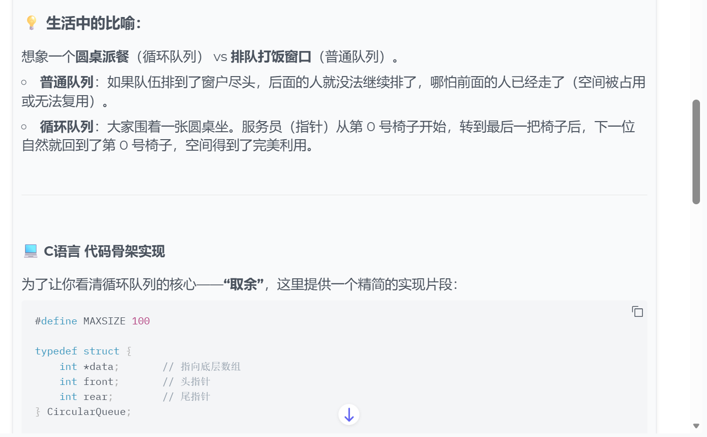
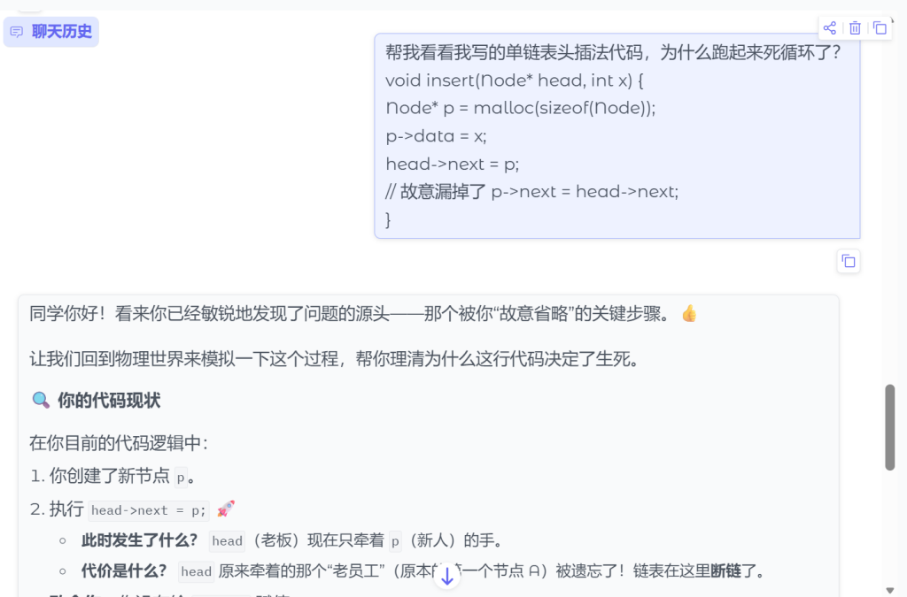
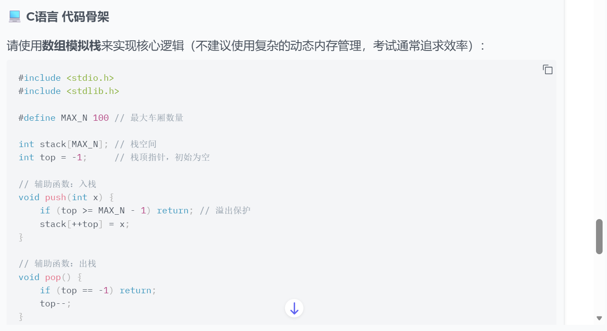
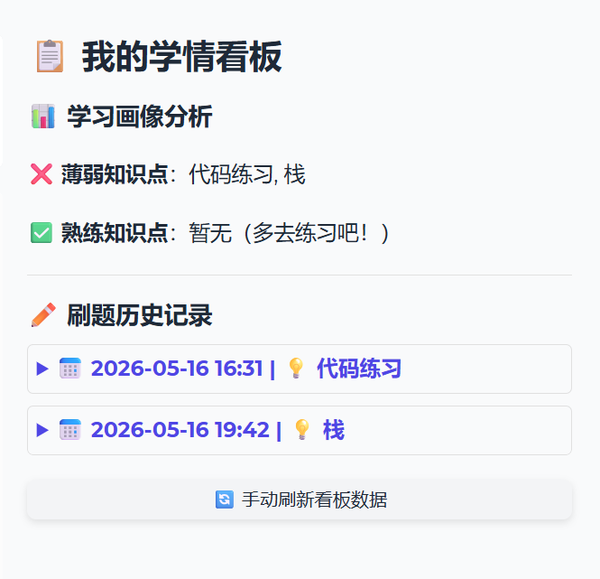
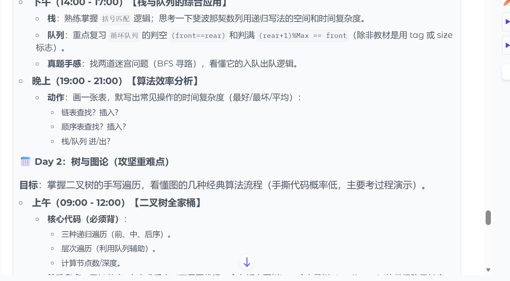

# 数据结构智能学伴系统 DataStructure-AI-Tutor

> 基于 **大语言模型 + RAG 检索增强生成 + Gradio Web UI** 的数据结构课程智能学伴系统。  
> 系统面向《数据结构》学习场景，提供知识问答、代码诊断、个性化练习、学习画像与学习规划能力。



---

## 目录

- [项目简介](#项目简介)
- [核心功能](#核心功能)
- [系统架构](#系统架构)
- [RAG 检索实现](#rag-检索实现)
- [功能演示](#功能演示)
- [项目结构](#项目结构)
- [环境配置与运行](#环境配置与运行)
- [技术栈](#技术栈)
- [项目亮点](#项目亮点)
- [后续优化方向](#后续优化方向)

---

## 项目简介

**数据结构智能学伴系统** 是一个面向数据结构课程学习的 AI 助教项目。系统不是简单地调用大模型回答问题，而是围绕真实学习过程设计了完整的教学闭环：

```text
学生提问 / 提交代码
        ↓
意图识别与教学模式切换
        ↓
RAG 知识库检索 / 代码诊断 / 练习生成
        ↓
大模型生成启发式反馈
        ↓
学习记录持久化
        ↓
学情画像与薄弱点更新
```

系统支持 **C 语言 / Python** 学习场景，可以根据学生的输入自动切换教学模式，例如概念讲解、代码排错、个性化出题和学习规划。

---

## 核心功能

### 1. 数据结构知识问答

系统能够回答数据结构课程中的核心概念问题，例如：

- 数组与链表
- 栈与队列
- 树与二叉树
- 图与图遍历
- 哈希表
- 查找算法
- 排序算法
- 时间复杂度与空间复杂度

当用户提出专业知识问题时，系统会优先调用本地 RAG 知识库，检索教材相关内容，再交由大模型生成结构化回答。

---

### 2. 代码诊断与启发式教学

当学生提交错误代码时，系统不会简单地直接给出最终答案，而是会：

- 分析代码中的潜在错误；
- 定位关键问题；
- 使用启发式问题引导学生思考；
- 给出修改方向与必要提示；
- 将相关薄弱知识点记录到学习画像中。

这种方式更接近真实助教的教学过程，能够帮助学生真正理解错误原因。

---

### 3. 个性化练习生成

系统可以根据学生当前的薄弱知识点生成针对性练习，包括：

- 题目描述；
- 输入输出格式；
- 示例数据；
- C / Python 代码骨架；
- TODO 填空区域；
- 提交后的批改反馈。

---

### 4. 学情画像与刷题记录

系统会将学生的学习过程记录到本地 JSON 文件中，包括：

- 历史对话；
- 练习记录；
- 错误记录；
- 薄弱知识点；
- 熟练知识点。

右侧看板会实时展示学生的学习状态，帮助用户了解自己的掌握情况。

---

### 5. 学习规划生成

当用户提出“帮我制定复习计划”等请求时，系统可以结合数据结构课程内容，为学生生成阶段性学习计划，包括：

- 考前复习安排；
- 每日学习目标；
- 重点知识点；
- 练习任务；
- 查漏补缺建议。

---

## 系统架构

系统整体由三层构成：

```text
交互界面层
├── Gradio 双栏界面
├── C / Python 语言选择器
├── 聊天窗口
├── 学情画像看板
└── 刷题历史记录

逻辑控制层
├── 教学模式识别
├── Prompt 构建
├── 流式响应控制
├── 多轮上下文主题抽取
└── Function Calling 工具调用

工具与数据层
├── RAGLibrary 向量检索
├── tools.py 外部工具封装
├── learning_log.py 学习记录持久化
└── library/docs 本地知识库
```



---

## RAG 检索实现

为了降低大语言模型在专业知识回答中的幻觉问题，系统实现了一套轻量级本地 RAG 架构。

### 1. 本地知识库构建

系统将 `library/docs/` 中的数据结构课程文档进行切块处理，并通过 Embedding API 转化为向量。

核心流程：

```text
课程文档
  ↓
滑动窗口切块
  ↓
Embedding 向量化
  ↓
NumPy 保存为本地索引
  ↓
运行时快速加载
```



---

### 2. 相似度召回

用户提问后，系统会将问题转化为查询向量，并与本地知识库向量矩阵计算余弦相似度，召回最相关的 Top-K 文本片段。

```text
用户问题
  ↓
查询向量
  ↓
余弦相似度计算
  ↓
Top-K 文档片段召回
```

---

### 3. 二次降噪过滤

传统 RAG 往往直接把检索片段拼接给主模型，容易引入噪声。  
本系统在 `tools.py` 中加入了二次降噪机制：先调用低温度模型对召回片段进行过滤和提纯，再将高质量上下文交给主模型生成最终回答。

```text
召回片段
  ↓
低温模型过滤
  ↓
去除无关内容
  ↓
生成高质量上下文
  ↓
主模型回答
```

---

### 4. Function Calling 工具路由

系统将 `rag_search` 注册为大模型可调用工具。当用户提出数据结构专业问题时，模型会主动调用该工具完成知识检索，实现自然语言理解与本地知识库的结合。

---

## 功能演示

### 1. 系统首页

系统采用双栏布局：左侧为核心聊天区，右侧为学情画像与刷题记录区域。



---

### 2. 知识问答演示

当用户询问“循环队列和普通队列有什么区别”时，系统会触发 RAG 检索，并输出定义、原理、代码示例和避坑指南。



系统能够进一步给出代码层面的实现细节，例如循环队列的初始化、入队、出队和判空判满逻辑。



---

### 3. 代码诊断演示

当用户提交存在问题的链表代码时，系统能够识别指针断裂等问题，并通过启发式提示引导用户修正。



---

### 4. 个性化练习演示

系统可以围绕学生薄弱知识点生成针对性练习，例如栈、队列、链表等主题，并给出代码骨架。



---

### 5. 学情画像看板

系统会把练习结果、薄弱知识点、熟练知识点和刷题历史记录持久化，并在右侧看板中动态展示。



---

### 6. 学习规划演示

用户可以让系统生成复习计划。系统会根据数据结构课程的知识体系安排每日任务和复习重点。



---

## 项目结构

```text
DataStructure-AI-Tutor/
│
├── main.py                  # 命令行 / 项目入口
├── web_app.py               # Gradio Web 交互界面与 Agent 控制逻辑
├── rag_library.py           # 本地 RAG 向量库构建与检索
├── tools.py                 # Function Calling 工具封装
├── learning_log.py          # 学习记录、错题记录与学情画像
├── environment.py           # 环境变量与模型配置
├── learning_log.json        # 学习日志数据
│
├── library/
│   ├── docs/                # 数据结构知识库文档
│   └── index.npz            # 本地向量索引，可由文档重新生成
│
├── assets/                  # README 展示图片
├── .gitignore
└── README.md
```

> 注意：`.env`、`__pycache__/`、`.venv/`、`library/index.npz` 等文件建议加入 `.gitignore`，避免上传密钥、缓存和可重新生成的索引文件。

---

## 环境配置与运行

### 1. 克隆项目

```bash
git clone https://github.com/tang3086/DataStructure-AI-Tutor.git
cd DataStructure-AI-Tutor
```

### 2. 创建虚拟环境

```bash
python -m venv .venv
```

Windows PowerShell：

```bash
.venv\Scripts\activate
```

macOS / Linux：

```bash
source .venv/bin/activate
```

### 3. 安装依赖

如果项目中已经有 `requirements.txt`：

```bash
pip install -r requirements.txt
```

如果还没有，可以根据项目使用到的库手动安装：

```bash
pip install gradio openai numpy python-dotenv
```

### 4. 配置环境变量

在项目根目录创建 `.env` 文件：

```env
API_KEY=your_api_key
BASE_URL=your_base_url
MODEL_NAME=your_model_name
EMBEDDING_MODEL=your_embedding_model
```

请不要把 `.env` 上传到 GitHub。

### 5. 启动 Web 系统

```bash
python web_app.py
```

启动后浏览器会打开 Gradio 页面，即可开始交互。

---

## 技术栈

| 模块 | 技术 |
|---|---|
| Web 界面 | Gradio |
| 后端语言 | Python |
| 大模型调用 | OpenAI SDK / 兼容接口 |
| 工具调用 | Function Calling |
| RAG 检索 | Embedding + Cosine Similarity |
| 向量存储 | NumPy `.npz` |
| 数据持久化 | JSON |
| 教学策略 | Prompt Engineering + 启发式引导 |

---

## 项目亮点

### 1. 面向教学场景，而不是普通聊天

系统不仅回答问题，还会根据用户意图切换到讲解、诊断、练习、规划等不同教学模式。

### 2. 自主实现轻量级 RAG

项目没有依赖大型向量数据库，而是使用 NumPy 实现本地向量检索，适合课程项目与轻量级部署。

### 3. 双重降噪机制

系统在召回知识片段后，先进行二次过滤，再交给主模型生成回答，从而减少无关文本对回答质量的干扰。

### 4. 学习闭环完整

系统实现了：

```text
提问 → 诊断 → 练习 → 记录 → 画像 → 再练习
```

能够根据学习记录持续更新用户的薄弱点和熟练点。

### 5. 支持 C / Python 双语言学习

适合数据结构课程常见的 C 语言教学，也兼顾 Python 学习需求。

---

## 后续优化方向

- [ ] 增加用户登录与多用户学习档案
- [ ] 增强代码自动运行与测试用例判题能力
- [ ] 引入知识图谱，构建数据结构知识依赖关系
- [ ] 支持更多课程知识库
- [ ] 优化 RAG 召回排序与重排机制
- [ ] 开发 Android 移动端版本
- [ ] 增加学习报告导出功能

---

## 项目总结

本项目面向数据结构课程学习场景，构建了一个具有知识问答、代码诊断、个性化练习、学情画像和学习规划能力的智能学伴系统。

系统通过 Gradio 提供流畅的 Web 交互体验，通过 RAG 检索增强降低专业问答中的幻觉问题，并利用学习日志构建诊断—练习—记录的闭环。整体上，该项目展示了大语言模型在教育辅助场景中的工程化应用能力。

---

## 作者

Tang  

